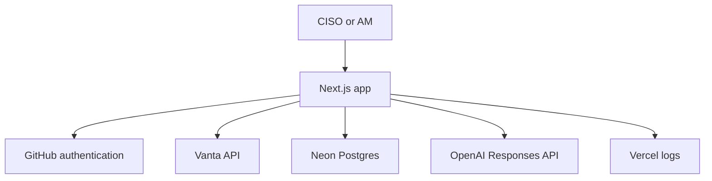

# Vanta Executive Briefing

A small Next.js app for a CISO or account team: it pulls Vanta compliance tests, stores dated snapshots in Postgres, calculates posture in application code, and asks OpenAI only to explain verified metrics.

**Intended user:** a CISO, security leader, or Solutions Engineer who needs trend and priority, not another raw control list.

## Architecture



The app calculates pass rates and failing counts. The model only receives that JSON. It never sees Vanta tokens or raw evidence payloads.

## Stack

- Next.js 16 App Router and TypeScript
- Neon Postgres with Drizzle ORM
- Vanta Manage API (`vanta-api.all:read`)
- Auth.js with GitHub
- OpenAI Responses API
- Vercel hosting and runtime logs

## Security decisions

- Vanta and OpenAI credentials stay in server environment variables. Nothing is prefixed `NEXT_PUBLIC_`.
- GitHub answers who the user is. Postgres memberships answer what they may do.
- Emails are stored and compared in lowercase so membership lookups match GitHub.
- `/api/sync` requires `ADMIN`. The dashboard and `/api/brief` require an organization membership.
- `/api/vanta-test` returns 404 in production. Use it only locally.
- Failed syncs store a safe error string, not secrets.

## AI grounding

`generateExecutiveBrief` loads the snapshot and ten failing-test fields from Postgres, then sends only that object to the model. Instructions forbid invented numbers or trends. Each brief is saved with `snapshotId`, `createdByEmail`, and `model`.

If OpenAI is down, the dashboard still works from stored snapshots.

## Observability

- `sync_runs` records status, initiator, duration, record count, and error message
- Structured JSON logs use event names such as `sync_started` and `sync_failed`
- `/admin/operations` shows the last 25 runs to admins
- `GET /api/health` checks database reachability and omits exception details

## Local setup

1. Copy `.env.example` to `.env.local` and fill in Neon, Vanta, OpenAI, and GitHub OAuth values.
2. Create a GitHub OAuth app with homepage `http://localhost:3000` and callback `http://localhost:3000/api/auth/callback/github`.
3. Install and migrate:

```bash
npm install
npm run db:migrate
npm run db:seed
npm run dev
```

4. Sign in once, then in Drizzle Studio (`npm run db:studio`) add a `memberships` row:
   - `organizationId`: Demo Organization
   - `userEmail`: the exact GitHub email, lowercase
   - `role`: `ADMIN`

Quality checks:

```bash
npm run lint
npm run typecheck
npm run build
```

## Known limitations

- One organization and one Vanta tenant
- Temporary sync protection depends on Auth.js plus memberships; do not expose an unauthenticated sync route
- No scheduled sync, membership admin UI, or per-customer Vanta OAuth yet

## Next steps

1. Pass-rate history chart
2. Admin membership management
3. Daily scheduled sync
4. Framework metrics and failing-entity drill-down
5. Per-customer Vanta OAuth with encrypted token storage
